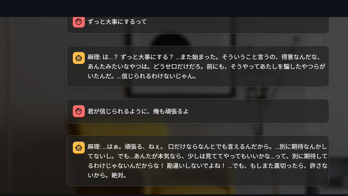

# 麻理チャットアプリ - Streamlit版

GradioからStreamlitに移行された麻理との対話型チャットアプリケーションです。

## 🚀 デプロイメント方法

### Hugging Face Spacesでのデプロイ

1. このディレクトリの全ファイルをHugging Face Spacesリポジトリにアップロード
2. Space設定で以下を設定:
   - **SDK**: "Docker"
   - **Hardware**: CPU basic（推奨）
3. 環境変数を設定（Settings > Variables and secrets）:
   - `TOGETHER_API_KEY`: Together.ai APIキー（**必須**）
   - `GROQ_API_KEY`: Groq APIキー（シーン検出用、**必須**）
   - `SYSTEM_PROMPT_MARI`: システムプロンプト（オプション）

**注意**: 
- Docker SDKを使用するため、自動的にDockerfileからビルドされます
- `TOGETHER_API_KEY`が設定されていない場合、デモモードで動作しますが機能が制限されます
- `GROQ_API_KEY`が設定されていない場合、シーン変更機能が無効になります
- Together.ai APIキーは [Together.ai Console](https://api.together.xyz/) で取得
- Groq APIキーは [Groq Console](https://console.groq.com/keys) で取得

### ローカルDockerでのデプロイ

Dockerファイルが必要な場合は、プロジェクトのルートディレクトリから取得してください。

### ローカル実行

```bash
# 依存関係をインストール
pip install -r requirements.txt

# アプリケーションを起動
streamlit run streamlit_app.py
```

## 📋 機能一覧

- ✅ リアルタイムチャット機能
- ✅ 好感度システム
- ✅ 動的背景変更
- ✅ セッション状態管理
- ✅ 感情分析
- ✅ メモリ管理
- ✅ エラーハンドリング
- ✅ レスポンシブUI

## 🧪 テスト結果

- 統合テスト: ✅ 全テスト通過
- Gradio機能比較: ✅ 100% 機能移行完了

## 📁 ファイル構成

```
spaces/
├── app.py                 # HF Spaces用エントリーポイント
├── streamlit_app.py       # メインアプリケーション
├── requirements.txt       # 依存関係
├── healthcheck.py        # ヘルスチェック用
├── components/           # UIコンポーネント
├── core/                # コア機能
├── static/              # 静的ファイル
└── .streamlit/          # Streamlit設定
```

## 🔧 環境変数

| 変数名 | 説明 | 必須 |
|--------|------|------|
| `TOGETHER_API_KEY` | Together AI APIキー | ✅ |
| `SYSTEM_PROMPT_MARI` | システムプロンプト | ❌ |
| `STREAMLIT_SERVER_PORT` | サーバーポート | ❌ |

## 📞 サポート

問題が発生した場合は、healthcheck.pyを実行して診断情報を確認してください。

```bash
python healthcheck.py
```


